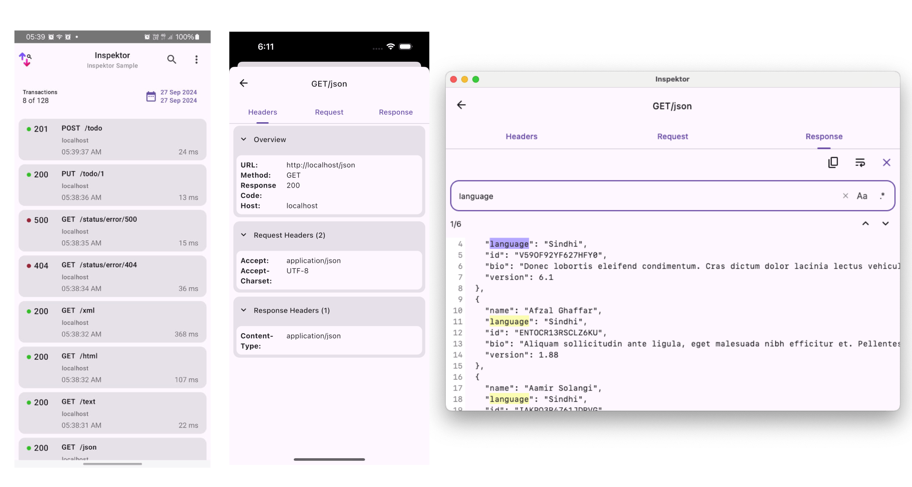

<div align="center">
  <picture>
    
  </picture>
</div>

# Inspektor 🕵️‍♂️


> ⚠️ This library is **not stable**, and the API may change. It is not advised to use it in
> production projects.⚠️

Inspektor is an HTTP inspection library for Ktor. It allows you to view HTTP requests and responses,
including basic information, headers, and bodies. Please note that this library is not stable, and
the API may change. Users are not advised to use it in production projects.



## Installation

Add the following dependency to your `build.gradle.kts` file:

```kotlin
dependencies {
  implementation("com.gyanoba.inspektor:inspektor:latest-version")
}
```

## Usage

To use Inspektor, install the plugin in your `HttpClient` configuration:

```kotlin
import io.ktor.client.HttpClient
import io.ktor.client.plugins.api.install
import io.ktor.client.request.get
import javax.management.InvalidApplicationException

// For Android this is enough
val client = HttpClient {
    install(Inspektor)
}

suspend fun apiCall() {
    client.get("http://example.com")
}
```

For ios you need to add following `-lsqlite3` to the Other Linker flags under Build Settings.
See more details [here](https://github.com/cashapp/sqldelight/issues/1442#issuecomment-523435492)

For Desktop platforms, you need to specify the APPLICATION_ID using `setApplicationId` before using
Inspektor.
This is used to determine the location to store the database file.

```kotlin
import data.db.setApplicationId

fun main() {
    setApplicationId("com.example.myapp")
    // ...
}
```

## Configuration

You can customize Inspektor using the `InspektorConfig` object. Here are the available options:

- `level`: Specifies the logging level. Available options
  are `LogLevel.NONE`, `LogLevel.INFO`, `LogLevel.HEADERS`, and `LogLevel.BODY`.
- `maxContentLength`: Sets the maximum content length for logging request and response bodies.
- `filter`: Allows you to filter log messages for calls matching a predicate.
- `sanitizeHeader`: Allows you to sanitize sensitive headers to avoid their values appearing in the
  logs.

### Example

```kotlin
install(Inspektor) {
    level = LogLevel.HEADERS
    maxContentLength = 100_000
    filter { request -> request.url.host.contains("example.com") }
    sanitizeHeader { header -> header == "Authorization" }
}
```

## Viewing the logs

Inspektor provides a UI to view the logs. You can access it by invoking `openInspektor` function.
This opens up a new activity in Android, a bottom sheet in iOS, and a new window in Desktop.

On Android you can also open the UI by clicking on the generated notifications.

## Upcoming Features 🚀

- Network interception functionality
- HAR export for detailed analysis
- More HTTP client support (OkHttp maybe?)

## License

This project is licensed under the MIT License. See the [LICENSE](LICENSE) file for details.

## Inspiration

This project is inspired by [Chucker](https://github.com/ChuckerTeam/chucker) - An HTTP inspector
for Android & OkHttp. It borrows many ideas (and some code 😉) from the project.

## Disclaimer ⚠️

This library is not stable, and the API may change. Users are not advised to use it in production
projects.
