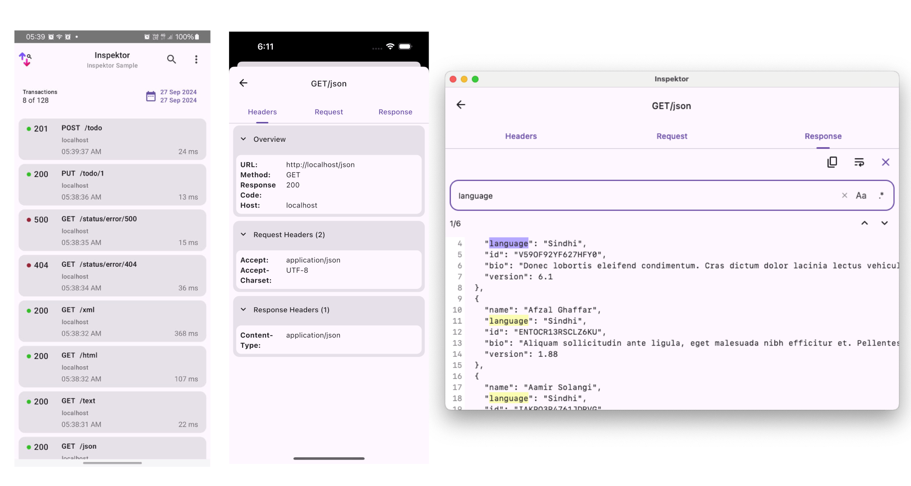

<div align="center">
  <picture>
    
  </picture>
</div>

# Inspektor 🕵️‍♂️

[](https://kotlinlang.org/)
[](https://github.com/ktorio/ktor)
[](https://central.sonatype.com/artifact/com.gyanoba.inspektor/inspektor)

> [!CAUTION]
> This library is **not stable**, and the API may change. It is not advised to use it in
> production projects.

Inspektor is an on-device HTTP inspector for Kotlin Multiplatform. It records every request and
response your app makes -- basic information, headers and bodies -- into a local database, shows
them in a Compose Multiplatform UI, and lets you *override* requests and responses for testing. It
works with **Ktor**, **OkHttp** and **NSURLSession**, all writing into the same store and the same
UI. Please note that this library is not stable, and the API may change. Users are not advised to
use it in production projects.

Here's an [introductory article](https://medium.com/@koreshreyash/inspektor-multiplatform-http-inspection-library-for-ktor-6c78ae5e5661) for those who are interested.



## Artifacts

Pick the integration for the HTTP client you actually use; each one brings the storage layer with
it, and the ones that need a UI bring that too.

| Artifact | What it is | Targets |
|---|---|---|
| `inspektor` | Umbrella: the Ktor plugin + the viewer. Unchanged coordinates and API. | android, jvm, iOS |
| `inspektor-ktor` | The Ktor client plugin on its own | android, jvm, iOS |
| `inspektor-okhttp` | An OkHttp `Interceptor` | android, jvm |
| `inspektor-urlsession` | `NSURLSession` capture (covers Alamofire, Moya, Get, ...) | iOS |
| `inspektor-ui` | The Compose Multiplatform viewer and `openInspektor()` | android, jvm, iOS |
| `inspektor-core` | Storage, recorder, override engine, HAR export. No client, no UI. | android, jvm, iOS |

`inspektor` still means what it always did, so existing setups keep working unchanged:

```kotlin
dependencies {
    implementation("com.gyanoba.inspektor:inspektor:latest-version")
}
```

For an OkHttp-only Android app, take the interceptor and the viewer and skip Ktor entirely:

```kotlin
dependencies {
    implementation("com.gyanoba.inspektor:inspektor-okhttp:latest-version")
    implementation("com.gyanoba.inspektor:inspektor-ui:latest-version")
}
```

Every artifact is released together and must be kept at the same version -- they share
`inspektor-core`, and a mismatched pair fails in confusing ways.

### Keeping Inspektor out of production builds

Inspektor bundles a database, a Compose UI and everything needed to inspect traffic, so you almost
certainly do not want it in your release binary. A companion artifact,
`com.gyanoba.inspektor:inspektor-no-op`, exists for exactly that: it exposes the **same public API**
under the same package, but every part of it is empty. The Ktor plugin installs no hooks, so
requests and responses are passed straight through — nothing is read, buffered, persisted or logged,
and no UI, database, notification or Compose code is shipped at all.

There is one no-op twin per integration entry point, because that is what your code names:

| Real | No-op twin |
|---|---|
| `inspektor` | `inspektor-no-op` |
| `inspektor-okhttp` | `inspektor-okhttp-no-op` |
| `inspektor-urlsession` | `inspektor-urlsession-no-op` |

(`inspektor-core` and `inspektor-ui` need none -- nothing in your code names them, and they simply
stop being pulled in.)

Depend on the real library only in the variant you debug with, and on the no-op everywhere else:

```kotlin
dependencies {
    // Android build types
    debugImplementation("com.gyanoba.inspektor:inspektor:latest-version")
    releaseImplementation("com.gyanoba.inspektor:inspektor-no-op:latest-version")

    // ...or Android product flavors
    devImplementation("com.gyanoba.inspektor:inspektor:latest-version")
    prodImplementation("com.gyanoba.inspektor:inspektor-no-op:latest-version")

    // ...and the same for the OkHttp integration
    debugImplementation("com.gyanoba.inspektor:inspektor-okhttp:latest-version")
    releaseImplementation("com.gyanoba.inspektor:inspektor-okhttp-no-op:latest-version")
}
```

Your code does not change. `install(Inspektor) { ... }`, `openInspektor()` and `setApplicationId()`
all still compile and run in both variants — they just do nothing in the no-op one.

Because the no-op artifact contains no Activity, no `ContentProvider`, no resources and no
`androidx.startup` initializer, it contributes nothing to your merged manifest either. Its only
dependency is `ktor-client-core`, which your project already has, so it adds no transitive
dependencies of its own.

The iOS `-lsqlite3` linker flag is only required for the real library; the no-op artifact needs no
platform setup at all.

#### What it saves

The `:sample` module in this repo is built in both configurations (`dev` uses the real library,
`prod` uses the no-op). Comparing the two release APKs, without R8/minification:

| | dev (real) | prod (no-op) | saved |
|---|---:|---:|---:|
| **APK on disk** | **10.58 MiB** | **9.96 MiB** | **0.62 MiB (5.9%)** |
| dex (uncompressed) | 29.8 MB | 28.0 MB | 1.81 MB |
| assets | 213 KB | 151 KB | 62 KB |

The `prod` APK contains no Inspektor implementation whatsoever — no `InspektorDatabase`, no UI
screens, no override repository, no retention manager, no HAR export, and none of SQLDelight, KStore
or JsonTree. Only the API stubs (`InspektorConfig`, `LogLevel`, `openInspektor`) survive. Its merged
manifest has no `MainActivity`, no `InspektorFileProvider` and no `ContextInitializer` entry.

Your own savings will differ: much of the dex delta above is Compose UI that the sample app already
uses elsewhere, and R8 will strip some of the rest in a real release build. The saving is larger for
an app that does not otherwise use Compose, SQLDelight or KStore.

#### Using it from Kotlin Multiplatform shared code

If you call `install(Inspektor)` or `openInspektor()` from `commonMain`, the API must be on the
common compile classpath for *every* target, so a per-variant `devImplementation` cannot express it.
Substitute the module for the production variants instead — see `sample/build.gradle.kts`:

```kotlin
configurations.matching { it.name.startsWith("prod") }.configureEach {
    resolutionStrategy.dependencySubstitution {
        substitute(module("com.gyanoba.inspektor:inspektor"))
            .using(module("com.gyanoba.inspektor:inspektor-no-op:latest-version"))
            .because("Inspektor must not ship in production builds")
    }
}
```

## Usage

### Ktor

Install the plugin in your `HttpClient` configuration:

```kotlin
// For Android this is enough
val client = HttpClient {
    install(Inspektor)
}

suspend fun apiCall() {
    client.get("http://example.com")
}
```

### OkHttp

Add the interceptor while building your client:

```kotlin
val client = OkHttpClient.Builder()
    .installInspektor {
        level = LogLevel.BODY
        sanitizeHeader { header -> header == "Authorization" }
    }
    .build()
```

`installInspektor` takes an `InterceptorMode`, and the choice matters:

- `InterceptorMode.APPLICATION` (the default) registers an *application* interceptor. It fires
  exactly once per call and sees the request as your app wrote it -- but it reports a cache hit as
  if it were a network call, and it does not see the individual hops of a redirect chain.
- `InterceptorMode.NETWORK` registers a *network* interceptor. It sees real wire traffic, including
  `Content-Encoding` and every redirect hop -- but it does not fire at all on a cache hit, and it
  fires more than once per call when there are redirects or retries.

Only a network interceptor has a connection, so the TLS version and cipher suite are recorded in
that position only.

Request bodies are read non-destructively; duplex and one-shot bodies are skipped rather than
consumed, so your actual request is never affected.

### NSURLSession (iOS)

Build your session with Inspektor's delegate. This is the recommended path -- it captures faithfully
and changes nothing globally:

```kotlin
val session = inspektorUrlSession(forwardTo = myOwnDelegate) {
    level = LogLevel.BODY
}
session.dataTaskWithRequest(request).resume()
```

One limit is worth knowing up front: **URLSession calls no delegate method at all for a task created
with `dataTask(with:completionHandler:)`** -- not even `didCompleteWithError` -- so those calls
cannot be seen from a delegate. Use delegate-driven tasks, or the opt-in `URLProtocol`:

```kotlin
// Must run before the app makes its first request.
InspektorUrlProtocol.register {
    level = LogLevel.BODY
}
```

`InspektorUrlProtocol` is zero-configuration and does capture completion-handler tasks, but it has
real costs: requests made before registration are invisible; it never sees `AVPlayer` traffic,
background sessions or WebSockets; registration is global and mutable and changes caching semantics;
and it re-issues each request through its own session, so a streamed download is buffered rather
than delivered incrementally. Prefer the delegate unless you cannot use it.

For ios you need to add the following `-lsqlite3` to the Other Linker flags under Build Settings.
See more details [here](https://github.com/cashapp/sqldelight/issues/1442#issuecomment-523435492)

For Desktop platforms, you need to specify the APPLICATION_ID using `setApplicationId` before using
Inspektor.
This is used to determine the location to store the database file.

```kotlin
fun main() {
    setApplicationId("com.example.myapp")
    // ...
}
```

## Configuration

You can customize Inspektor using the `InspektorConfig` object. Here are the available options:

- `level`: Specifies the logging level. Available options
  are `LogLevel.NONE`, `LogLevel.INFO`, `LogLevel.HEADERS`, and `LogLevel.BODY`.
- `maxContentLength`: Sets the maximum content length for logging request and response bodies.
- `filter`: Allows you to filter log messages for calls matching a predicate.
- `sanitizeHeader`: Allows you to sanitize sensitive headers to avoid their values appearing in the
  logs.
- `showNotifications`: If set to `true`, notifications will be shown for HTTP requests. Defaults to `true`.
- `retentionDuration`: Specifies the duration for which the logs will be retained. Defaults to 30 days.

### Example

```kotlin
install(Inspektor) {
    level = LogLevel.HEADERS
    maxContentLength = 100_000
    filter { request -> request.url.host.contains("example.com") }
    sanitizeHeader { header -> header == "Authorization" }
    showNotifications = true
    retentionDuration = 30.days
}
```

## Overriding Requests and Responses

This feature is meant to be used for testing purposes. It allows you to override the request
and response bodies.
To use this feature, open the overrides page from the menu. Add new overrides by specifying matchers for the request; then select the action to perform, i.e.
override the request or response. Only the values specified are replaced in the request or response.
Empty values are ignored.


https://github.com/user-attachments/assets/d779934d-3e9c-447e-8f37-94869c251717


You can easily add new overrides by clicking on the Edit icon in the Transactions List screen.
Default override with original info gets created which you can then modify to get your desired result.

## Viewing the logs

Inspektor provides a UI to view the logs. You can access it by invoking `openInspektor` function.
This opens up a new activity in Android, a bottom sheet in iOS, and a new window in the Desktop.

On Android you can also open the UI by clicking on the generated notifications.

## HAR Export

Inspektor supports exporting the logs in HAR format. You can export the logs by clicking on the
"Export as HAR" button in the UI. This allows you to analyze the logs in detail using tools like
[HAR Viewer](https://toolbox.googleapps.com/apps/har_analyzer/) or [Fiddler](https://www.telerik.com/fiddler).

## Upcoming Features 🚀

- [x] Request-Response overriding functionality
- [ ] Pause and allow editing Request and Response
- [x] HAR export for detailed analysis
- [x] More HTTP client support -- OkHttp and NSURLSession
- [ ] React Native package

## License

This project is licensed under the MIT License. See the [LICENSE](LICENSE) file for details.

## Inspiration

This project is inspired by [Chucker](https://github.com/ChuckerTeam/chucker) - An HTTP inspector
for Android & OkHttp. It borrows many ideas (and some code 😉) from the project.

## Disclaimer ⚠️

This library is not stable, and the API may change. Users are not advised to use it in production
projects.
